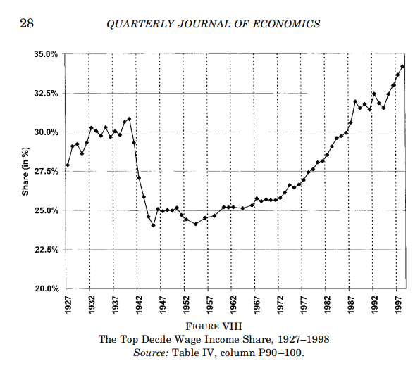

```{r setup, include=FALSE}
options(htmltools.dir.version = FALSE)
knitr::opts_chunk$set(
  fig.width=6, fig.height=3.5, fig.retina=3,
  out.width = "100%",
  cache = FALSE,
  echo = FALSE,
  message = FALSE, 
  warning = FALSE,
  hiline = TRUE,
  dev = "png", 
  dev.args = list(type = "cairo-png")
)

library(tibble)
library(ggplot2)
library(showtext)
library(dplyr)
library(cowplot)
library(kableExtra)
library(readxl)

font_add_google("Lato", "Lato")
font_add_google("Merriweather", "Merriweather")
theme_set(theme_minimal(base_family = 'Lato', base_size=16))
```

```{r xaringan-themer, include=FALSE, warning=FALSE}
library(xaringanthemer)


colores <- c(celeste="#5e82ae", 
             color3="#89a2c3",
             color1="#698BB4",
             color2="#5D81AD",
             verde="#4E7B7B")

# ,,5D81AD,,000000
style_mono_accent(
  base_color = "#5e82ae",
  #secondary_color = "",
  header_font_google = google_font("Lato"),
  text_font_google   = google_font("Merriweather"),
)
```

<style>

.center2 {
  margin: 0;
  position: absolute;
  top: 50%;
  left: 50%;
  -ms-transform: translate(-50%, -50%);
  transform: translate(-50%, -50%);
}

</style>


# Bienestar

- Si pudieran nacer de nuevo en otro país, ¿cuál elegirían?
- ¿Qué tanta suerte tuvieron por haber nacido en Uruguay?

- Bienestar objetivo vs. subjetivo.
- La función de utilidad. Jeremy Bentham.

---
# Medición 

- Permite comparar en el __tiempo__ y __entre países__.

Dos Indicadores:

- PIB per cápita

- Índice de Desarrollo Humano (IDH)

---
# PIB per cápita

- Repartimos la producción del país entre todos los habitantes.

- Nos da una medida de cuánto produce una sociedad.

---
# PIB per cápita en Uruguay

```{r fig.width=10}
maddison <- here::here('mpd2018.xlsx') %>% 
  read_xlsx(sheet="Full data") %>% 
  filter(countrycode %in% c("URY", "ARG", "FIN", "USA", "ITA")) %>% 
  filter(year %in% c(1900, 1955, 2000))

maddison %>% 
  ggplot(aes(year, cgdppc, color = country)) + 
  geom_line() + 
  geom_point() +
  scale_color_discrete(name = "País") +
  labs(x="Año", y="PIB per cápita", caption="Fuente: Angus Maddison") +
 theme_minimal(base_size = 18) + 
  theme(legend.position = "bottom")

```


---

## Problemas

- No toma en cuenta como se distribuye la riqueza.

- Solo toma en cuenta aspectos económicos del bienestar.


---

# El IDH

- Toma en cuenta la salud, la educación y el acceso a bienes y servicios.

## Cálculo

Usa los indicadores de: 

- Esperanza de vida al nacer

- Años promedio de educación

- Ingreso per cápita

Los convierte en un índice (para que tengan una unidad de medida comparable) y calcula el promedio.

---
## El IDH de Uruguayo

- En 2014, Uruguay estaba en el puesto 50 de los 187 países para los que se calcula el IDH.
- En la región, solo Argentina y Chile tenían índices mejores.


---
## Pobreza

- Es la privación de un hogar o una persona en el acceso a bienes y servicios que le permiten desarrollar una vida plena.

- No hay consenso en qué significa esta "vida plena", ni cuál es el nivel de acceso a bienes y servicios mínimos necesario para lograrla.

- Hay consenso sobre que esto requiere ciertas capacidades para hacer ciertas cosas, así como desempeñar ciertos roles.

---
## Medición

### El enfoque monetario

- Implica definir un nivel monetario de ingreso debajo del cual las personas se consideran pobres.

- En Uruguay, el INE realiza una encuesta (la Encuesta de Continua de Hogares) en las que releva todas las fuentes de ingresos de los hogares:

  - Ingreso Laboral.
  - Jubilaciones y Pensiones.
  - Ingresos del capital.
  - Transferencias
  

---

## La línea de pobreza

- La línea de pobreza es el umbral de ingresos por debajo del que un hogar se considera pobre.

- Se calcula en base a una Canasta de Bienes Alimentarios y una Canasta de Bienes no Alimentarios.

---
## Pobreza vs. indigencia

- Los hogares con ingresos menores a la CBA son clasificados como indigentes.

- Los hogares con ingresos menores a la $CBA + CBNA$ son clasificados como pobres.

- La fórmula exacta toma en cuenta la cantidad de personas del hogar.


---
## Necesidades Básicas Insatisfechas

Busca evaluar si un hogar o una persona logra condiciones de vida mínimas en dimensiones no monetarias:

- Educación
- Vivienda
- Acceso a agua potable y saneamiento

Un hogar es considerado pobre si alguna de estas necesidades no está satisfecha.

Es más difícil de calcular y de usarlo para comparaciones.


---
## Pobreza en Uruguay


Fuente: [CEPAL](https://repositorio.cepal.org/bitstream/handle/11362/44415/1/S1801038_es.pdf)

---
## Pobreza en Uruguay


---
<blockquote class="twitter-tweet"><p lang="es" dir="ltr"><a href="https://twitter.com/hashtag/LaLetraChica?src=hash&amp;ref_src=twsrc%5Etfw">#LaLetraChica</a> Vigorito: &quot;Hay un desafío que es pasar de un concepto de pobreza, que lo relevante que tiene es que por detrás está la discusión de los fines últimos de una sociedad determinada y qué condiciones mínimas de vida debería tener una persona en esa sociedad&quot;. <a href="https://t.co/bK8QiqdRfg">pic.twitter.com/bK8QiqdRfg</a></p>&mdash; laletrachicatv (@laletrachicatv) <a href="https://twitter.com/laletrachicatv/status/1308561264579411968?ref_src=twsrc%5Etfw">September 23, 2020</a></blockquote> <script async src="https://platform.twitter.com/widgets.js" charset="utf-8"></script>

---

# Distribución del Ingreso

- Ingreso vs. Riqueza.
- La distribución de la riqueza no mide el capital humano.

---
# Medición de la desigualdad

- Participación por decil.
  

  
---

background-image: url(imgs/noventa_nueve.jpg)
background-position: right bottom

# Participación por decil


---

# La Curva de Lorenz

- Permite visualizar la desigualdad en toda la distribución

- Graficamos la participación acumulada por decil

- La recta de 45º implica que todos tienen la misma participación

- Cuanto más lejos está la curva de Lorenz de la recta de 45º más desigual es la distribución

---
# Comparación de curvas de Lorenz

.pull-left[
- ¿Cuál es más desigual?
]

.pull-right[

]


---

# El índice de Gini

- Es el cociente entre la distancia de la curva a la recta y el área total.

- Mide el grado de desigualdad de una economía.

---

# Gini mundial


---
# Ingreso y Desigualdad

```{r warning=FALSE, message=FALSE, echo=FALSE}
library(tidyverse)
library(readxl)
library(ggrepel)

theme_set(theme_minimal() + 
            theme(plot.title = element_text(hjust=.5)))

# PIB per capita
# GDP per capita (2017 PPP $)
pib_per_cap <- read_xlsx("gdp_per_capita.xlsx", skip=5) %>% 
  filter(!is.na(`HDI Rank`)) %>% 
  filter(!is.na(Country)) %>% 
  transmute(pais=Country, pib_per_cap=as.numeric(`2019`))

# Indice de GINI
# Income inequality, Gini coefficient
desigualdad <- read_xlsx("gini.xlsx", skip=5) %>% 
  filter(!is.na(`HDI Rank`)) %>% 
  filter(!is.na(Country)) %>% 
  transmute(pais=Country, gini=as.numeric(`2010-2018`))

df <- inner_join(pib_per_cap, desigualdad, by="pais")


# Casos interesantes
df_highlight <- filter(df, pais %in% c("Chile", "Uruguay", "United States", 
                                       "Brazil", "South Africa",
                                       "Norway", "Sweden", "Denmark"))


ggplot(df, 
       aes(x=log(pib_per_cap), y=gini)) +
  geom_point() + 
  geom_smooth(method="lm") +
  geom_point(color="red", data=df_highlight) +
  geom_label_repel(aes(label=pais), data=df_highlight) +
  labs(title="Desarrollo económico y desigualdad",
       x="Pib per Cápita (log)", y="Índice de Gini", 
       caption="Fuente: http://hdr.undp.org/")
```


---

# Causas de las desigualdades económicas

- Cambio tecnológico

- Globalización

- Assortative mating

- Participación del capital

- Transmisión intergeneracional de la riqueza

---

# Cambio tecnológico


- Plot


---

# Redistribución de la riqueza

- Impuestos

- Transferencias

- Servicios subsidiados 
  - Educación
  
  - Salud
